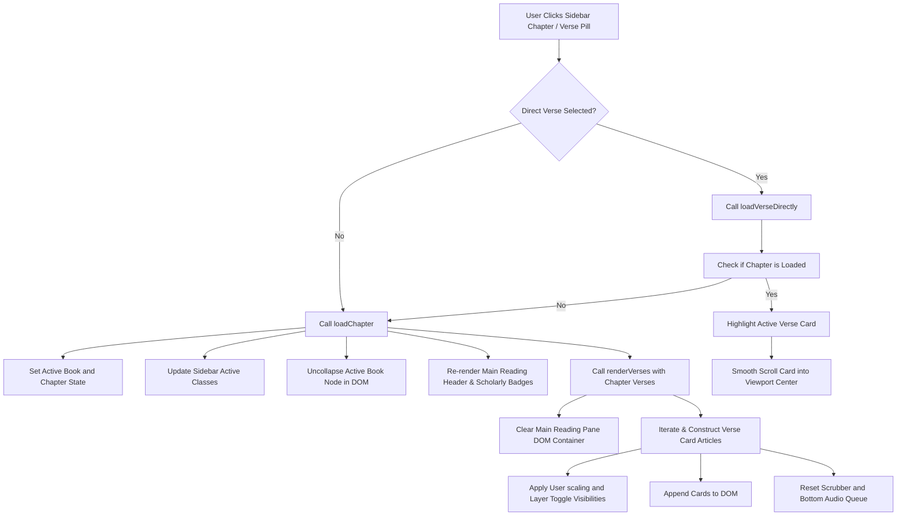
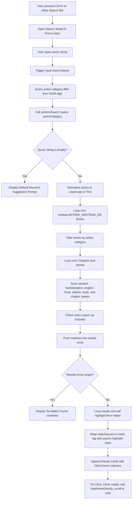
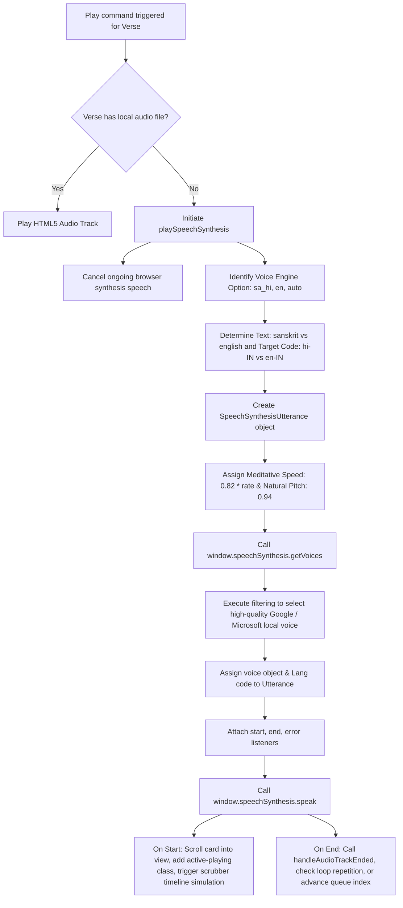
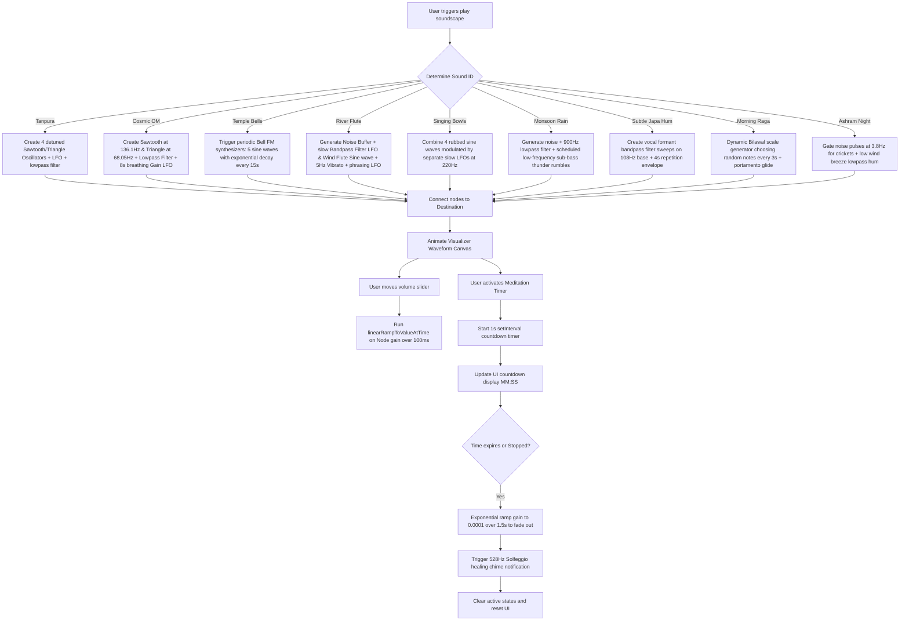

# Architecture & Workflow Documentation ✦ कार्यप्रवाह

This document maps out the internal operational workflows, data flows, and runtime lifecycles that govern the user interactions and media rendering in the Antara Library.

---

## ◈ 1. Sidebar Selection & Main Reading Pane Re-Rendering

The core user journey involves navigating the scriptures via the sidebar tree. When a user selects a chapter or direct verse, the following workflow is executed:



### Key Functions
- `loadChapter(bookId, chapterId)`: The primary router that resets active IDs, updates sidebar styling, and calls the DOM compiler.
- `renderVerses(verses)`: Iteratively compiles structural nodes using template literals, attaches event handlers (`copy`, `bookmark`, `play`), and injects them into the viewport.
- `highlightActiveVerseCard(verseId)`: Finds the card using `getElementById('card_' + verseId)` and applies the `.active-playing` CSS glow effect.

---

## ◈ 2. Live Search Indexing Workflow

The search system dynamically filters the database as the user types without requiring database calls:



### Search Highlight Helper
Matches are highlighted on-the-fly using a safe regex builder:
```javascript
function highlightTerm(text, query) {
  if (!text || !query) return text;
  const escaped = query.replace(/[-\/\\^$*+?.()|[\]{}]/g, '\\$&');
  const regex = new RegExp(`(${escaped})`, 'gi');
  return text.replace(regex, '<mark class="search-highlight">$1</mark>');
}
```

---

## ◈ 3. Text-to-Speech (TTS) Audiobook Playback Lifecycle

Speech Synthesis requires careful device voice synchronization, cadence control, and visual synchronization:



### Meditative Cadence & Quality Assurance
- **cadence**: Playback is purposely kept slow (`rate: 0.82`) to allow users to digest complex syllables, and the pitch is shifted down (`pitch: 0.94`) to replicate a resonant vocal delivery.
- **voiceschanged Listener**: Ensures that browsers that load voices dynamically or asynchronously have their cache warmed up on boot, preventing audio from playing in default, low-quality voices.

---

## ◈ 4. Dhyana Sanctuary Audio Synthesis & Timer Workflow

The meditation sanctuary utilizes synthesized sound nodes designed via the Web Audio API that run completely offline without assets:



